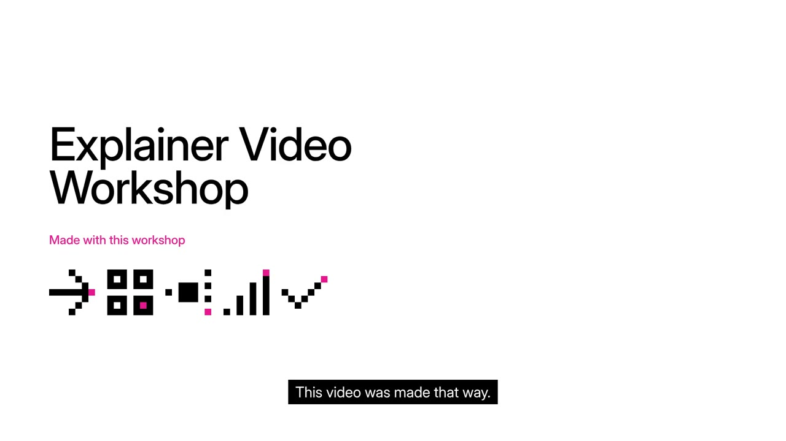
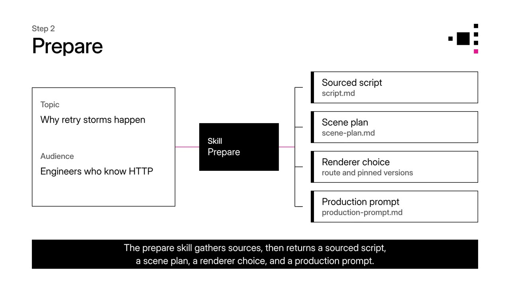
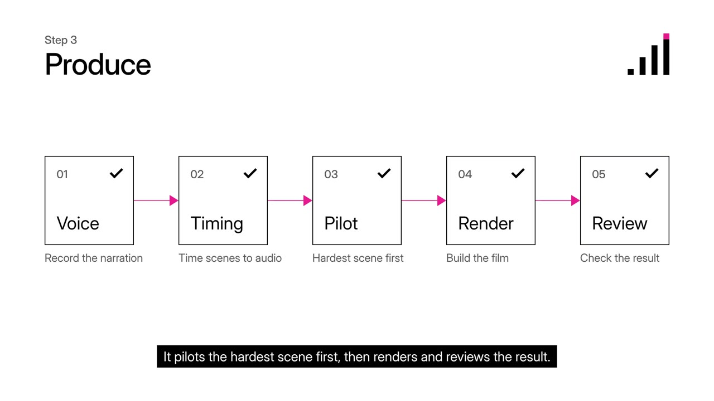
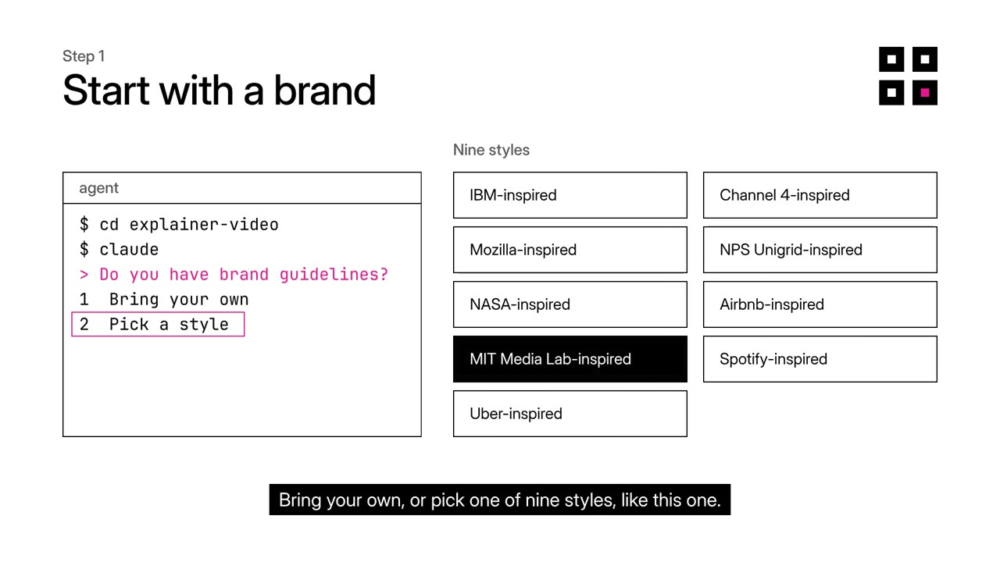
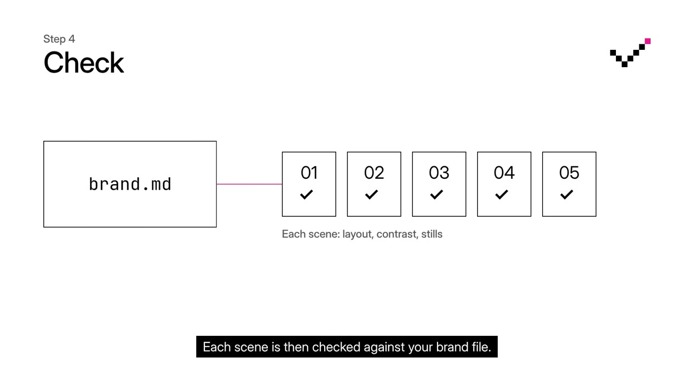

# Explainer Video Workshop

[](https://jac-marais.github.io/explainer-video-workshop/brands/mit-media-lab.mp4)

▶ [Watch the 44-second overview](https://jac-marais.github.io/explainer-video-workshop/brands/mit-media-lab.mp4), in the workshop's MIT Media Lab-inspired style.

Turn a technical subject and trustworthy sources into a narrated video that explains a mechanism clearly. Sustained agent work is a production technique; the job is the explanation. Models and renderers can change without renaming the workshop.

## Why a workshop

A workshop is a room set up for one craft. A wood shop and a metal shop need different tools, skills and safety rules, and you would never weld next to the sawdust. A woodworker can still learn metalwork by walking into the other shop. Agents work the same way. This repo is the shop for explainer videos. Open the folder, and the agent gets the methods, templates, checks and sources this craft needs.

## Start here

Open this folder in an agent harness and ask:

> Prepare a three-minute explainer about why retry storms happen for engineers who understand HTTP. Give me a sourced script, a scene plan, a renderer choice, and a production prompt with an eight-hour ceiling.

The [preparation method](methods/prepare-explainer-video.md) produces a usable package without claiming that a video exists. The [production prompt](templates/production-prompt.md) then guides an authorized production run through narration, measured timing, a hard-scene pilot, scene construction, rendering, review, and editable handoff. Eight hours is an adjustable ceiling. Stop when the result passes; waiting is not a quality step.

<p>
<a href="https://jac-marais.github.io/explainer-video-workshop/brands/mit-media-lab.mp4#t=16"></a>
<a href="https://jac-marais.github.io/explainer-video-workshop/brands/mit-media-lab.mp4#t=27"></a>
</p>

## Brand guidelines

The workshop is brand-neutral. On first use, the agent asks whether you have brand guidelines, then records your answer in `local/brand.md`, which is git-ignored. The answer can be a path to a brand workshop, a document, a URL, or "none". No guidelines? [See the nine workshop styles](https://jac-marais.github.io/explainer-video-workshop/brands/) and tell the agent which one you want. From then on, every run styles and audits its output against that source through [the brand method](methods/brand-explainer-video.md). To change brands, edit or delete `local/brand.md`. The [profile template](templates/brand.md) shows its shape.

<p>
<a href="https://jac-marais.github.io/explainer-video-workshop/brands/mit-media-lab.mp4#t=5"></a>
<a href="https://jac-marais.github.io/explainer-video-workshop/brands/mit-media-lab.mp4#t=37"></a>
</p>

## Voice

Narration uses a stock local voice, Kokoro `af_heart`, unless you clone your own. On first use, the agent offers to clone yours with Qwen3-TTS on an Apple Silicon Mac, from a one-minute recording. Your choice, the recording and the narration CLI live in `local/voice/`, which is git-ignored. You can still ask any run for the stock voice, and a run in progress keeps the voice it started with. See [the voice method](methods/voice-explainer-video.md).

## Use the shelves by job

| Job | Start with |
|---|---|
| Investigate public examples, prompts, and skills | [Prior art](library/prior-art.md) |
| Choose HTML, live app capture, React, math animation, or hosted generation | [Renderers](library/renderers.md) |
| Prepare a run | [Method](methods/prepare-explainer-video.md), [brief](templates/brief.md), [scene plan](templates/scene-plan.md), [storyboard](templates/storyboard.html) |
| Align output with your brand | [Brand method](methods/brand-explainer-video.md) and [profile template](templates/brand.md) |
| Execute a prepared run | [Production prompt](templates/production-prompt.md) and [scorecard](scorecards/run-quality.md) |
| Check evidence | [Source map](library/source-map.md) and [manifest](library/manifest.json) |

## Layout and runtime

```text
AGENTS.md                   mission, routing, guarantees
brands/                     style gallery, published on GitHub Pages
library/                    source map, prior art, renderer notes
methods/                    preparation, brand, and voice procedures
templates/                  files copied into a run or local/
scorecards/                 preparation and production-evidence gates
outputs/                    new user work (git-ignored)
local/                      operator's brand profile, voice, and pronunciation verdicts (git-ignored)
.agents/skills/             preparation and brand skills
.claude/skills/             link to .agents/skills for Claude Code
```

Only the workshop itself is committed: routing, methods, templates, scorecards, the library, the style gallery, and the skills. Everything an agent produces while working stays local and git-ignored, under `outputs/` and `local/`.

The skills live in `.agents/skills/`, and `.claude/skills` links to that folder, so Codex and Claude Code share one copy. `CLAUDE.md` points to `AGENTS.md`. The skills rely on this workshop's maintained methods/templates and resolve paths from the repository root; they are not standalone video engines.

No MCP server, cloud renderer, voice API, or vendor skill bundle is required to prepare a run. Follow the selected route's current, pinned setup instructions and record actual versions in a production project. Vendor installers may refresh global skill sets; check their target before running them.

This workshop is not a generic video studio, a model leaderboard, a collection of copied third-party prompts, or a scheduler that keeps an agent alive for eight hours. Source videos, voices, service credits, and private documents retain their own use boundaries. See [source use](library/source-map.md#use-rules).

## License

The workshop is [MIT licensed](LICENSE). Cited third-party sources keep their own licenses.
